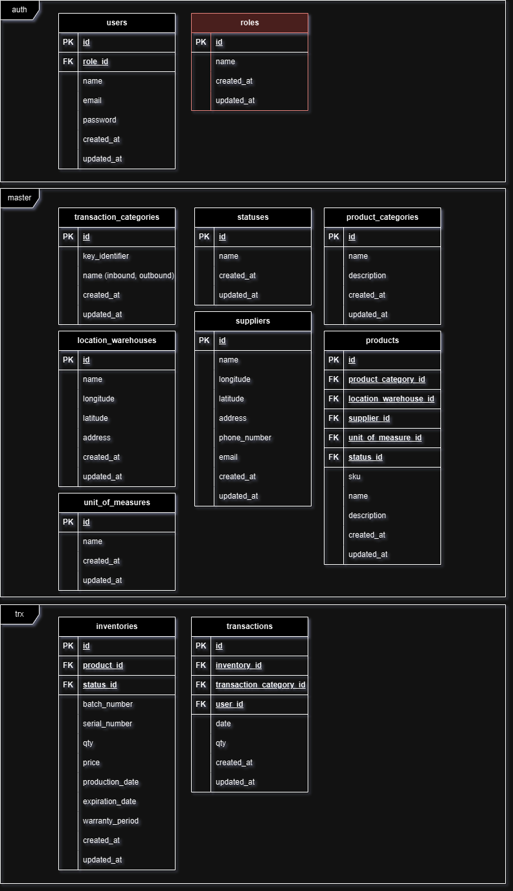

# Sistem Gudang Rest API

**Sistem Gudang** is a management application designed to streamline and optimize warehouse operations with advanced features. The application includes modules for managing warehouse information, such as location and structural details, as well as supplier data including contact information and company details. With its product category feature, users can organize products by category for easier searchability. The system also allows for efficient product management, including the addition, editing, and deletion of products. Other key features include managing products with unique SKUs and serial numbers, and monitoring product stock to ensure availability. Additionally, the application provides capabilities for managing inventory with attention to expiration dates and product warranty periods, ensuring optimal quality and compliance in every aspect of warehouse operations.


## Entity Relationship Diagram




## Features

- Warehouse information
- Supplier information
- Product category
- Manage Product
- Product available with SKU and Serial Number
- Inventory to make product stock
- Inventory available with expiration_date and warranty_period \
etc.


## Installation

Clone it

```bash
    git clone https://github.com/aqshalzuhdi/sistem-gudang-api.git
    cd sistem-gudang-api
    composer install
```

Install with docker

```bash
    Next update!
```

Set-up your .env files

```bash
    cd sistem-gudang-api
    cp .env.example .env
```

Assign JWT Secret on .env file

```bash
    php artisan vendor:publish --provider="PHPOpenSourceSaver\JWTAuth\Providers\LaravelServiceProvider"
    php artisan jwt:secret
```

Migrate all table to database

```bash
    php artisan migrate
```

Create new resource using seeder \
This command can create user, status, and transaction category

```bash
    php artisan db:seed
```

User detail: \
Email: aqshal@asal.my.id \
Password: 123456

## Deployment

To deploy this project run

```bash
  cd /path/to/sistem-gudang-project
  php artisan serve
```

## Documentation

[Documentation Postman](https://documenter.getpostman.com/view/4749256/2sAXjM5s5f)
[API URL](https://sistem-gudang.asal.my.id/api)

## Tech Stack

**Framework:** Laravel 11 \
**RDBMS:** MySQL / MariaDB

## Authors

- [@aqshalzuhdi](https://www.github.com/aqshalzuhdi)

## Follow Me on Social Media

- [@yaelahshal](https://www.instagram.com/yaelahshal)
- [Muhammad Aqshal Falasifah Zuhdi](https://www.linkedin.com/in/muhammad-aqshal-falasifah-zuhdi-853165274/)


## License

[MIT](https://choosealicense.com/licenses/mit/)

